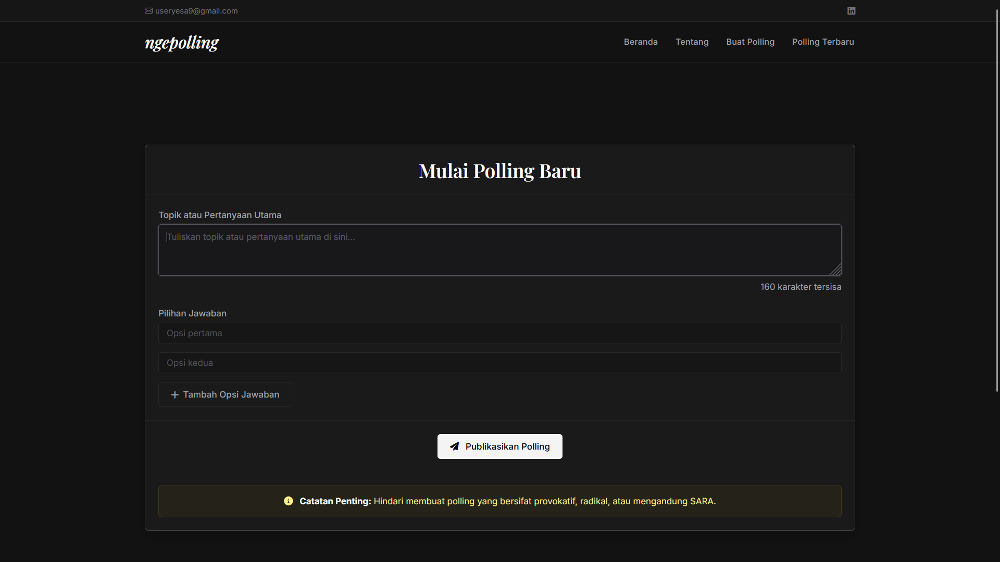

# ngepolling 🗳️



[](https://laravel.com)
[](https://php.net)
[](https://opensource.org/licenses/MIT)

**ngepolling** adalah aplikasi web polling sederhana namun tangguh yang dirancang untuk memudahkan pengguna dalam membuat jajak pendapat (polling) secara instan, membagikannya, dan mengumpulkan suara dengan aman. Aplikasi ini dibangun menggunakan framework **Laravel 11**, **Bootstrap**, dan didukung oleh **Vite** untuk pengelolaan aset frontend.

Aplikasi ini dilengkapi dengan fitur keamanan dasar seperti pembatasan jumlah polling harian dan pencegahan *double-voting* berdasarkan alamat IP.

---

## ✨ Fitur Utama

- **📝 Pembuatan Polling Instan**: Pengguna dapat membuat polling baru dengan menentukan judul (minimal 5 karakter) serta menambahkan beberapa opsi jawaban secara dinamis.
- **🛡️ Anti-Spam (Batas Polling Harian)**: Membatasi pengguna untuk membuat maksimal **3 polling per hari** untuk setiap alamat IP.
- **🔒 Anti Double-Voting**: Mencegah pemungutan suara berulang kali oleh pengguna yang sama. Sistem mencatat alamat IP pemilih dan hanya mengizinkan **1 suara per IP** untuk setiap polling.
- **📊 Hasil Polling Real-time**: Menampilkan persentase dan hasil perolehan suara secara langsung setelah pengguna selesai melakukan voting.
- **🔍 Pencarian Polling**: Memudahkan pencarian jajak pendapat yang aktif dan terbaru berdasarkan judul polling.
- **📱 Desain Responsif**: Antarmuka modern yang nyaman diakses melalui perangkat mobile maupun desktop menggunakan Bootstrap dan font kustom.

---

## 🛠️ Teknologi yang Digunakan

- **Backend**: PHP >= 8.2 & Laravel 11.x
- **Frontend**: Blade Templating, Bootstrap, Font Awesome (Icons)
- **Asset Manager**: Vite
- **Database**: SQLite (default/development) atau MySQL

---

## 📂 Struktur Database

Aplikasi menggunakan 4 tabel utama untuk mengelola data polling dan voting:

1. **`pollings`**: Menyimpan data utama jajak pendapat.
   - `id` (Primary Key)
   - `title` (Judul Polling)
   - `timestamps`
2. **`jawabans`**: Menyimpan pilihan jawaban/opsi untuk setiap polling.
   - `id` (Primary Key)
   - `polling_id` (Foreign Key terhubung ke `pollings`)
   - `option` (Teks opsi jawaban)
   - `vote` (Jumlah perolehan suara, default: 0)
   - `timestamps`
3. **`votes`**: Melacak siapa saja yang sudah memilih berdasarkan IP.
   - `id` (Primary Key)
   - `polling_id` (Foreign Key terhubung ke `pollings`)
   - `ip_address` (Alamat IP pemilih)
   - `timestamps`
4. **`batas_pollings`**: Melacak batas pembuatan polling per hari untuk masing-masing IP.
   - `id` (Primary Key)
   - `ip_address` (Alamat IP pembuat)
   - `jumlah_polling` (Jumlah polling yang dibuat pada hari tersebut)
   - `tanggal_polling` (Tanggal pembuatan terakhir)
   - `timestamps`

---

## 🚀 Panduan Instalasi dan Penggunaan

Ikuti langkah-langkah berikut untuk menjalankan project ini secara lokal di komputer Anda:

### 1. Prasyarat (Prerequisites)
Pastikan komputer Anda sudah terinstall:
- **PHP** (minimal versi 8.2)
- **Composer**
- **Node.js & NPM**
- **Laragon / XAMPP** (jika ingin menggunakan database MySQL)

### 2. Kloning Repositori
```bash
git clone https://github.com/nullablenone/website-polling.git
cd website-polling
```

### 3. Instalasi Dependensi
Jalankan perintah berikut untuk menginstal dependensi PHP dan Javascript:
```bash
# Instal dependensi backend (Composer)
composer install

# Instal dependensi frontend (NPM)
npm install
```

### 4. Konfigurasi Environment (`.env`)
Salin file konfigurasi `.env.example` menjadi `.env`:
```bash
cp .env.example .env
```
Secara default, Laravel akan menggunakan **SQLite**. Jika Anda ingin menggunakan SQLite, buat file database kosong di folder database:
- Windows (PowerShell):
  ```powershell
  New-Item -Path database\database.sqlite -ItemType File
  ```
- Linux/Mac/Git Bash:
  ```bash
  touch database/database.sqlite
  ```
*Catatan: Jika ingin menggunakan MySQL, silakan sesuaikan konfigurasi `DB_CONNECTION`, `DB_HOST`, `DB_PORT`, `DB_DATABASE`, `DB_USERNAME`, dan `DB_PASSWORD` di dalam file `.env`.*

### 5. Generate Application Key
```bash
php artisan key:generate
```

### 6. Jalankan Migrasi Database
Jalankan perintah berikut untuk membuat tabel database yang diperlukan:
```bash
php artisan migrate
```

### 7. Jalankan Server Pengembangan
Buka dua tab terminal dan jalankan perintah di bawah ini secara bersamaan:

- **Terminal 1** (Menjalankan server Laravel):
  ```bash
  php artisan serve
  ```
- **Terminal 2** (Menjalankan kompilasi aset frontend Vite):
  ```bash
  npm run dev
  ```

Buka browser Anda dan akses aplikasi di alamat `http://127.0.0.1:8000`.

---

